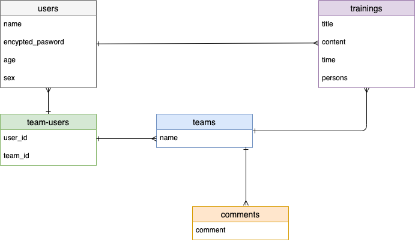

# アプリケーション名
VOLLEYBALL-NOTE

# アプリケーション概要
- このアプリはバレーボールの練習記録を管理する為のアプリです。
- ユーザー登録を行う事で練習ノートを作れます。
- 練習メニューを投稿、編集、削除できます。振り返る事で練習の質を上げましょう。(2022/06/24時点では投稿機能のみ)
- 練習メニューには画像を添付して他者が見た時にイメージしやすいです。(2022/06/24時点未実装)
- チーム登録を行う事でチームの練習ノートを作成でき、チームメンバー同士で共有できます。(2022/06/24時点未実装)
- コメント機能にてチームメンバー同士でやりとりできます。(2022/06/24時点未実装)
- 是非ご活用ください。

# URL
- https://volleyball-note.herokuapp.com/

# テスト用アカウント
- Basic認証ID : 
- Basic認証パスワード : 
- ユーザー名 : 
- パスワード : 

# 利用方法
1. トップページ左下から新規登録orログインを行う
2. 投稿済みの練習メニューが左側に表示されるのでタイトルをクリックすると詳細が中央に表示されます
3. 投稿済みの練習メニューの表示の有無に関わらず新規投稿を中央下部より行えます。

# アプリケーションを作成した背景
自分自身の趣味でバレーボールをしているのですが、練習の記録をノートに記録し「バレーボールノート」を作っていました。そういったサービスがWeb上かアプリでないか探した所見つからず、自分で作ってみたいと考え開発することにしました。

# 洗い出した要件
要件定義シート↓↓
https://docs.google.com/spreadsheets/d/1oK53YT8ZJBIgf9_A8CWFAB0SG00TxvU1QlmziTLEVbA/edit#gid=982722306

# 実装した機能についての画像やGIFおよびその説明

# 実装予定の機能
現在、画像投稿機能を実装中。
今後、投稿済み練習メニューの編集、削除機能をJavascriptを用いた非同期通信にて実装予定。

# データベース設計

# 画面遷移図
※トップページのみで完結しているので遷移しません。

# 開発環境
- Ruby on rails
- Javascript
- Jquery
- HTML/CSS

# ローカルでの動作方法
以下のコマンドを順に実行。
% git clone https://github.com:piroyuki666/volleyball-note.git
% cd xxxx
% bundle install
% yarn install

# 工夫したポイント
初めてのアプリ作成で今の自分が覚えたい機能に焦点を当て作成しようと考えました。その覚えたい機能というのがJavascript、Jqueryでした。
非同期通信のメリットを活かし、トップページで完結する事で通信回数をユーザー切り替え時の１度だけにしました。